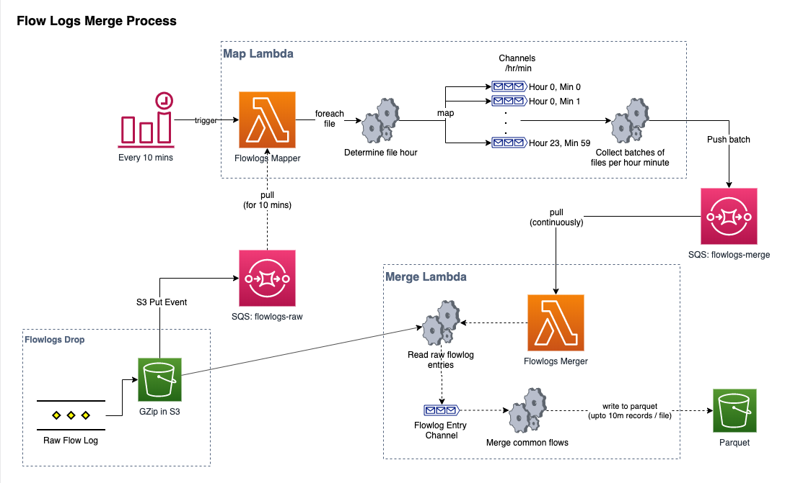

# AWS Flowlogs Merge Tool
This is a simple tool to designed for large organisations who generate a significant number of flowlog files per day across their accounts and wish to use query tools like Amazon Athena or Presto to analyse their flowlog data.

Due to the significant number of files generated per day (potentially close to 1m / day), it is unreasonable to expect query tools to download and read all of these files to process each query, and if the data is stored in S3, the significant number of GET requests could become cost prohibitive as well.

The solution is to operate a continuous map + merge process over the raw flowlogs data files as they are dropped into S3, combining files between accounts, and merging continuous flows between files - the end result is upto a 99% reduction in number of files, and upto 40% reduction in overall storage size.

## Design

The process is broken up into two independent steps: 

* **Map**: Sorts files into batches for each minute of the day, and pushses batches of files to process onto an SQS Queue
* **Merge**: Merges all records in a batch into one or more parquet files, combining common flows when found




## Pre-requisites

Before starting, you must have the following: 
1. 2 SQS Queues: 
  - flowlogs-raw
  - flowlogs-merge
2. Your raw flowlog files for all accounts being funneled into an S3 bucket in a single account, and an S3 Object Creation event pushing a message to the flowlogs-raw SQS queue

## Build + Deploy

Simplest way to build + deploy everything is to run this command: 

```

# Install Dependencies
make deps

# Build, Test and Deploy (replace my-artifact-bucket with the S3 bucket you want to use to store your artifacts)
ARTIFACT_BUCKET=my-artifact-bucket make

# Build, Test and Deploy with custom Cloudformation Parameters, eg. 
ARTIFACT_BUCKET=my-artifact-bucket PARAMS="OutputBucket=my-output-bucket OutputPath=merged/ TrackingTableName=MyFlowlogsTrackingTable" make
```

This will: 
- Test, Vet and Build the Code
- Package + Deploy the [SAM Template](/template.yaml), which creates: 
  - 2 Lambda Functions
    - flowlogs-mapper: Performs the MAP step
    - flowlogs-merger: Performs the MERGE step
  - CloudWatch Event (rate(10 minutes)) that is an EventSource to the flowlogs-mapper function
  - DDB Table for tracking what files have been processed


